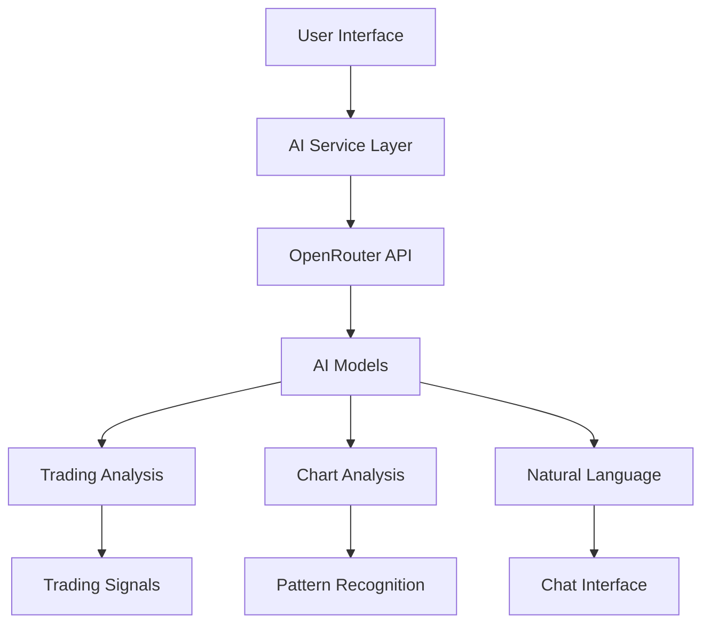

# AI Pipeline Integration

The Cheshire Trading Terminal integrates advanced AI capabilities through OpenRouter's API, providing real-time analysis, trading suggestions, and natural language interaction.

## Architecture Overview



## AI Models

### Vision Model
- **Model**: x-ai/grok-vision-beta
- **Purpose**: Chart pattern recognition and technical analysis
- **Features**:
  - Real-time chart analysis
  - Pattern identification
  - Support/resistance detection
  - Trend analysis

### Language Model
- **Model**: sao10k/l3.3-euryale-70b
- **Purpose**: Natural language interaction and market analysis
- **Features**:
  - Trading suggestions
  - Market sentiment analysis
  - Risk assessment
  - Portfolio insights

## Integration Points

### 1. Chart Analysis
```typescript
interface ChartAnalysisRequest {
  chartImage: string;  // Base64 encoded chart image
  timeframe: string;   // e.g., "1H", "4H", "1D"
  indicators: string[]; // Active technical indicators
}

interface ChartAnalysisResponse {
  patterns: {
    type: string;      // e.g., "double_top", "head_shoulders"
    confidence: number;
    coordinates: number[][];
  }[];
  support_resistance: {
    level: number;
    type: "support" | "resistance";
    strength: number;
  }[];
  trend: {
    direction: "bullish" | "bearish" | "neutral";
    strength: number;
    targets: number[];
  };
}
```

### 2. Trading Signals
```typescript
interface TradingSignalRequest {
  token: string;
  timeframe: string;
  position?: {
    entry: number;
    size: number;
    type: "long" | "short";
  };
}

interface TradingSignalResponse {
  action: "buy" | "sell" | "hold";
  confidence: number;
  entry_points: number[];
  stop_loss: number;
  take_profit: number[];
  risk_assessment: {
    score: number;
    factors: string[];
  };
}
```

### 3. Natural Language Processing
```typescript
interface ChatRequest {
  message: string;
  context?: {
    chart?: string;
    portfolio?: PortfolioState;
    marketData?: MarketData;
  };
}

interface ChatResponse {
  message: string;
  analysis?: {
    type: "technical" | "fundamental" | "sentiment";
    details: Record<string, any>;
  };
  suggestions?: {
    action: string;
    reasoning: string;
    confidence: number;
  }[];
}
```

## Implementation Example

```typescript
import { OpenRouterService } from '../services/ai';

class AIAnalyzer {
  private openRouter: OpenRouterService;

  constructor() {
    this.openRouter = new OpenRouterService({
      apiKey: process.env.VITE_OPEN_ROUTER_API_KEY,
      visionModel: 'x-ai/grok-vision-beta',
      languageModel: 'sao10k/l3.3-euryale-70b'
    });
  }

  async analyzeChart(chartImage: string): Promise<ChartAnalysisResponse> {
    const analysis = await this.openRouter.analyzeImage({
      image: chartImage,
      prompt: "Analyze this trading chart for patterns, trends, and key levels."
    });

    return this.parseChartAnalysis(analysis);
  }

  async getTradingSuggestions(token: string): Promise<TradingSignalResponse> {
    const marketData = await this.fetchMarketData(token);
    const suggestion = await this.openRouter.analyze({
      context: marketData,
      prompt: "Provide trading suggestions based on current market conditions."
    });

    return this.parseTradingSuggestions(suggestion);
  }

  async chatWithAI(message: string, context?: any): Promise<ChatResponse> {
    return this.openRouter.chat({
      message,
      context,
      systemPrompt: "You are Chesh, an expert crypto trading assistant."
    });
  }
}
```

## Usage in Components

### Chart Analysis Component
```typescript
const ChartAnalysis: FC<Props> = ({ chartRef }) => {
  const handleAnalysis = async () => {
    const chartImage = await chartRef.current?.captureChart();
    const analysis = await aiAnalyzer.analyzeChart(chartImage);
    
    // Update UI with analysis results
    updatePatterns(analysis.patterns);
    updateLevels(analysis.support_resistance);
    updateTrend(analysis.trend);
  };
};
```

### Trading Assistant Component
```typescript
const TradingAssistant: FC = () => {
  const handleQuery = async (message: string) => {
    const context = {
      chart: await captureCurrentChart(),
      portfolio: await getPortfolioState(),
      marketData: await getCurrentMarketData()
    };

    const response = await aiAnalyzer.chatWithAI(message, context);
    
    // Update UI with AI response
    updateChatHistory(response);
    if (response.suggestions) {
      updateTradingSuggestions(response.suggestions);
    }
  };
};
```

## Configuration

The AI pipeline can be configured through environment variables:

```env
# AI Configuration
VITE_OPEN_ROUTER_API_KEY=your_api_key
VITE_OPEN_ROUTER_VISION_MODEL=x-ai/grok-vision-beta
VITE_OPEN_ROUTER_ROLEPLAY_MODEL=sao10k/l3.3-euryale-70b

# Feature Flags
VITE_ENABLE_AI_FEATURES=true
VITE_ENABLE_CHART_ANALYSIS=true
VITE_ENABLE_TRADING_SIGNALS=true
```

## Best Practices

1. **Rate Limiting**
   - Implement proper rate limiting for API calls
   - Cache analysis results when appropriate
   - Use websockets for real-time updates

2. **Error Handling**
   - Implement robust error handling
   - Provide fallback options when AI services are unavailable
   - Log errors for monitoring and improvement

3. **Context Management**
   - Maintain relevant context for accurate analysis
   - Clear context when switching tokens/timeframes
   - Optimize context size for API calls

4. **Performance**
   - Optimize image sizes for vision analysis
   - Implement request batching when appropriate
   - Use progressive loading for UI updates

## Security Considerations

1. **API Key Management**
   - Never expose API keys in client-side code
   - Implement proper key rotation
   - Use environment variables for sensitive data

2. **Data Privacy**
   - Only send necessary data to AI services
   - Implement data anonymization where appropriate
   - Follow data retention policies

3. **Request Validation**
   - Validate all inputs before sending to AI services
   - Implement request signing
   - Monitor for unusual patterns

## Monitoring and Analytics

1. **Performance Metrics**
   - Response times
   - Analysis accuracy
   - Usage patterns

2. **Error Tracking**
   - API failures
   - Analysis errors
   - Model performance issues

3. **Usage Analytics**
   - Feature utilization
   - User engagement
   - Model effectiveness

## Future Improvements

1. **Model Enhancements**
   - Custom model training
   - Specialized trading models
   - Enhanced pattern recognition

2. **Feature Expansion**
   - Multi-model analysis
   - Advanced risk assessment
   - Automated trading strategies

3. **Integration Improvements**
   - Additional AI providers
   - Enhanced context management
   - Real-time analysis streaming
